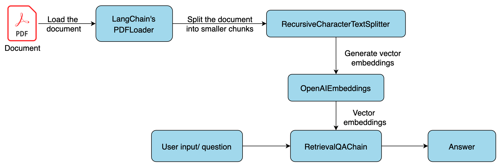

# Resume Q&A Project

This is a learning project to create an OpenAI bot that will be able to answer questions from a PDF resume file.
For demo purpose, I shamelessly use [my resume](apps/backend/src/assets/Hung%20-%20resume.pdf) as a pre-defined asset to test it :D

## Folder Structure

```
/my-monorepo
│
├── /apps
│   ├── /backend    # Express.js backend
│   │   ├── src
│   │   │   ├── index.ts
│   │   │   └── routes.ts
│   │   ├── package.json
│   │   ├── tsconfig.json
│   │   └── .env
│   └── /frontend   # React.js or any frontend framework
│       ├── src
│       │   ├── index.tsx
│       │   └── App.tsx
│       ├── package.json
│       └── tsconfig.json
├── package.json    # Monorepo-level package.json with workspace settings
└── .gitignore
```

## Backend (apps/backend)

The backend is a simple Express.js app which expose a POST endpoint `/api/get-answer` to pass the question for the document to multiple methods from `langchain` library to retrieve the final answer.

Overall flow will be like this:


- Load the PDF document using `PDFLoader`.
- Split the document using `RecursiveCharacterTextSplitter` into smaller chunks of text.
- Generate a vector store to store the documents as vector embeddings so that the text can become searchable. For the demo purpose, this will use `MemoryVectorStore` to store in memory instead of using a persistent storage like Postgres using `pgvector` extension.
- Use `RetrievalQAChain` and set OpenAI's model as LLM and the vector store as the data to process the question from the input.

Notes: to not exhausting OpenAI credits, I use an in-memory `lruCache` object to cache data and result. In reality, we can use Redis cache for this purpose.

## Frontend (apps/frontend) - TODO

Frontend will be a simple HTML web page, on which we will render a form where the user can provide questions and click the "Get answer!" button. Once we get the answer from OpenAI using the PDF document, we will render the answer on the web page with a button to copy the answer to the clipboard.

## Deployment

The deployment will use fly.io platform to host.
