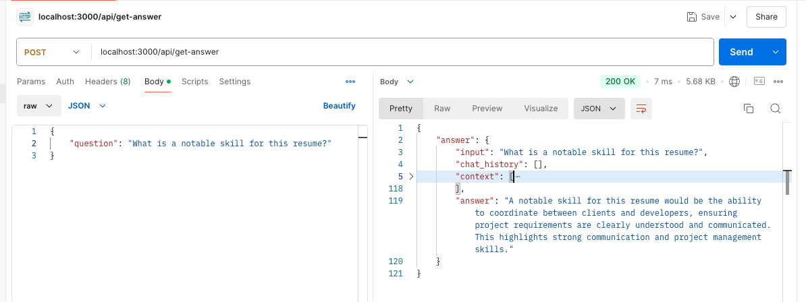

# Resume Q&A Project

This is a learning project to create an OpenAI bot that will be able to answer questions from a parsed document.

Some use cases:

- You are a headhunt and you want to have a quick scan of a candidate's resume to get his/her most notable skills.
- You are a customer support and you want to upload a Knowledge base document to let users easily ask questions for it.

Actually, OpenAI can process many kind of documents. But for a better learning scope, this project focuses on parsing resume pdf files only.

And for demo purpose, I shamelessly use [my resume](apps/backend/src/assets/Hung%20-%20resume.pdf) as a pre-defined document to verify it :D

### Demonstrated Skills

- [x] Set up a Node.js app using Express.js and TypeScript
- [ ] Set up a frontend to process user input with React and Vite (_TODO_)
- [x] Interact with third-party SDKs like OpenAI
- [x] Get a basic concept of using OpenAI for parsing and analyzing documents
- [x] Use caching mechanism to avoid exshausting OpenAI credits
- [ ] Deploy backend and frontend apps separately to fly.io platform as different services like in real world projects (_TODO_)

## Folder Structure

```
/my-monorepo
│
├── /apps
│   ├── /backend    # Express.js backend
│   │   ├── src
│   │   │   ├── index.ts
│   │   │   └── routes.ts
│   │   ├── package.json
│   │   ├── tsconfig.json
│   │   └── .env
│   └── /frontend   # React.js or any frontend framework
│       ├── src
│       │   ├── index.tsx
│       │   └── App.tsx
│       ├── package.json
│       └── tsconfig.json
├── package.json    # Monorepo-level package.json with workspace settings
└── .gitignore
```

## Backend (apps/backend)

The backend is an Express.js app which expose an endpoint `POST /api/retrieve-answer` to pass the question for the document to multiple methods from `langchain` library to retrieve the final answer.

Endpoints:

- `GET /documents`: return a list of candidate's profiles. For demo purpose, this is an in-memory object instead of using a real database like Postgres.
- `POST /retrieve-answer`: pass user question for a specific file

Overall flow will be like this:


- Load the PDF document using `PDFLoader`.
- Split the document using `RecursiveCharacterTextSplitter` into smaller chunks of text.
- Generate a vector store to store the documents as vector embeddings so that the text can become searchable. For the demo purpose, this will use `MemoryVectorStore` to store in memory instead of using a persistent storage like Postgres using `pgvector` extension.
- Use `RetrievalQAChain` and set OpenAI's model as LLM and the vector store as the data to process the question from the input.

Notes: to not exhausting OpenAI credits, an in-memory `lruCache` object is used to cache data and result. In reality, we can use Redis cache for this purpose.

A sample response will be like this:


## Frontend (apps/frontend)

_TODO_
Frontend will be a HTML web page, on which we will render a form where the user can provide questions and click the "Get answer!" button.
Once we get the answer from OpenAI using the PDF document, we will render the answer on the web page with a button to copy the answer to the clipboard.

Components:

- ProfileList: display a list of candidate's profiles to select.
- PDFViewer: render the PDF file for selected profile.
- QuestionForm: render a form for user to input questions for the selected profile.

## Deployment

The deployment will use fly.io platform to create 2 separate apps for backend and frontend.

## Some improvement ideas

- Add an endpoint to allow uploading pdf files
- Add a controller to store pdf files on Postgres
- Add methods to store questions and answers on Postgres
- Use Redis to cache answers from OpenAI
- Use server push event or websocket to stream answer response to frontend
